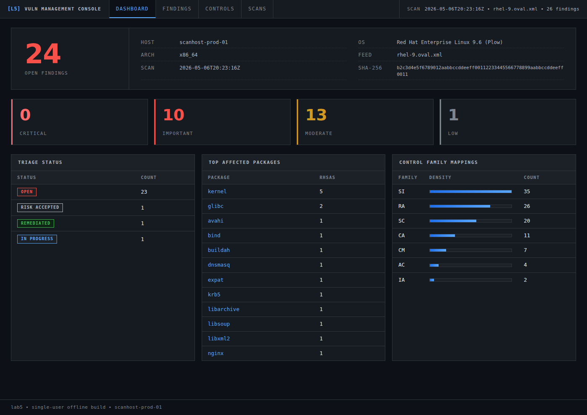
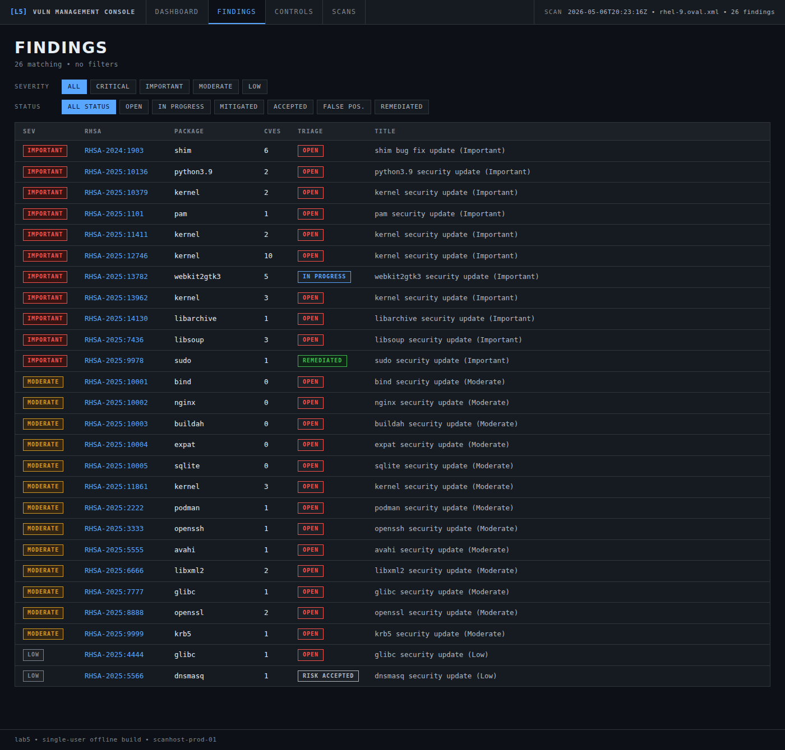
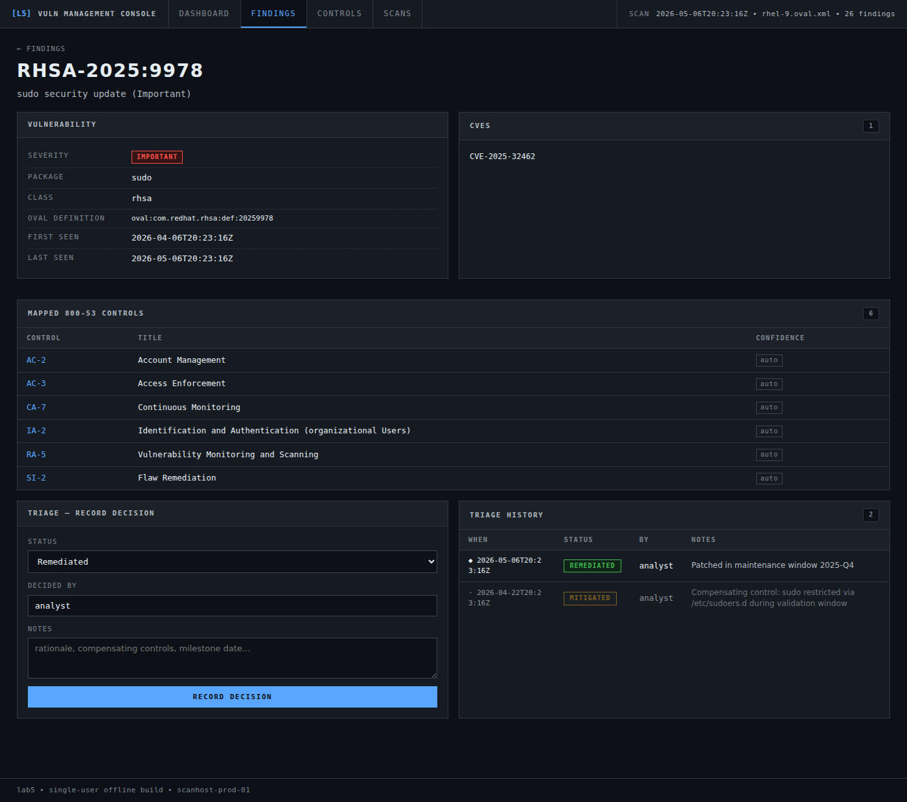
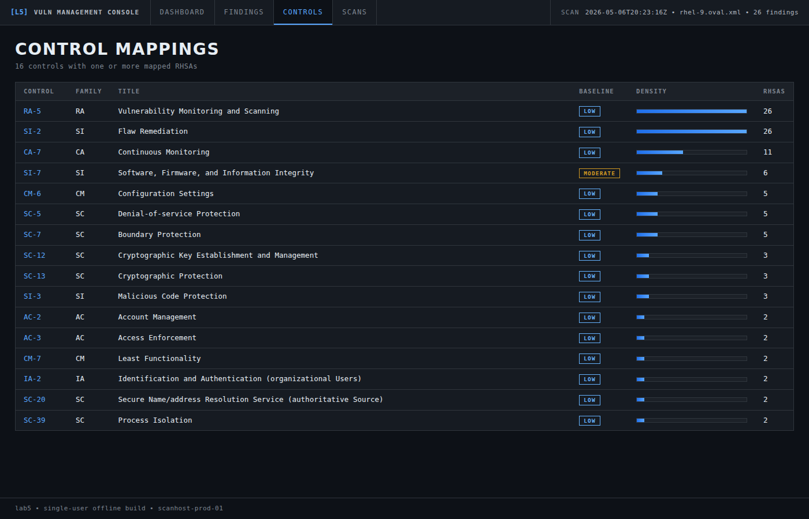
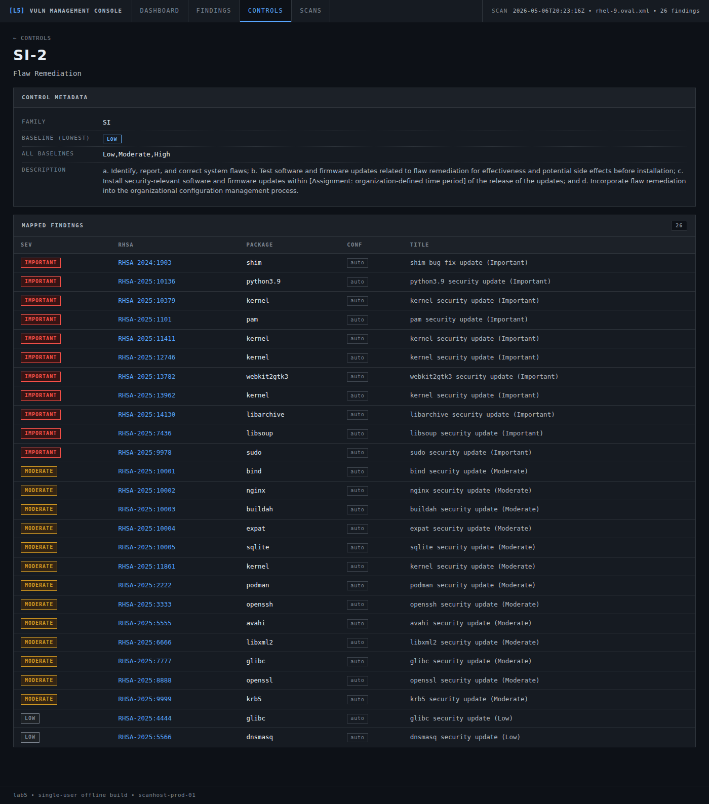
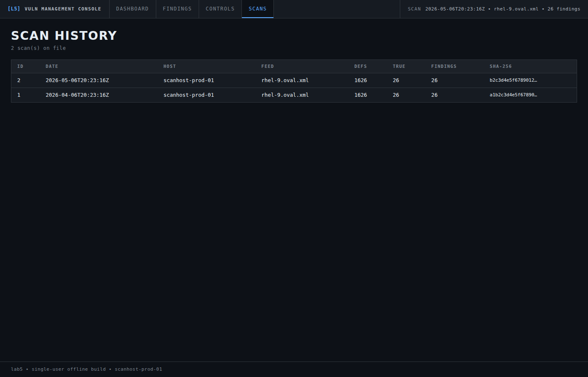

# lab5 — ACAS-equivalent vulnerability management pipeline

A working offline vulnerability management toolchain for RHEL 9, built end-to-end with **Python 3 standard library only — no `pip install`, no third-party RPMs, no internet access required at runtime.**

This is a portfolio project that mirrors the workflow of commercial ACAS / Tenable.sc deployments in airgapped defense-contractor environments. It ingests OpenSCAP OVAL scan results into SQLite, maps each finding to NIST 800-53 Rev 5 controls, and serves a triage console over a localhost-only HTTP server.



## Why stdlib-only

Defense-contractor cleared environments commonly forbid `pip install` and require explicit approval for any new RPM. The traditional answer ("just maintain your own offline wheel mirror") is its own audit problem. This project takes the harder path: every component runs on a stock RHEL 9 install with only `python3.9` and `openscap-scanner` present.

That constraint shaped the design:

- **XLSX parsing without `openpyxl`** — the NIST 800-53 catalog ships as `.xlsx`. `bin/build-controls-csv` reads it by treating the file as what it is (a zip of XML), using `zipfile` and `xml.etree.ElementTree` to extract the SpreadsheetML cells directly. ~150 lines, zero deps.
- **Web UI without Flask** — `bin/lab5-web` is a single 1,500-line file using `http.server`, `string.Template`, and embedded CSS/JS. Server-rendered HTML, form-POST triage actions, no JS framework, no build step.
- **OVAL XML parsing without `lxml`** — `bin/acas-import` uses `xml.etree.ElementTree` with namespace-aware queries to extract findings, CVE references, and system fingerprints from OpenSCAP results.

## Architecture

```
   PowerShell workstation                       Airgapped RHEL 9 VM
   ────────────────────────                     ───────────────────────────
                                                
   Get-Lab5Bundle.ps1  ──── tar+sha256 ────►   /home/<user>/lab5/content/
   (downloads OVAL feeds                        oval/rhel-9.oval.xml
    and NIST 800-53 XLSX,                       sp800-53r5-control-catalog.xlsx
    hashes for chain-of-                        sp800-53b-control-baselines.xlsx
    custody verification)
                                                       │
                                                       ▼
                                                 oscap oval eval ──► results.xml
                                                       │
                                                       ▼
                                                 bin/acas-import ──► lab5.db
                                                                       │
                                                       bin/build-controls-csv  
                                                       bin/load-controls       
                                                       bin/auto-map-controls   
                                                                       │
                                                                       ▼
                                                              bin/lab5-web
                                                                  :5000
                                                                       ▲
                            ◄── ssh -L 5000:127.0.0.1:5000 ────────────┘
                            (browser → localhost:5000)
```

## What the toolchain produces

After running the full pipeline you get a single SQLite file (`lab5.db`) with:

- **Scans** — one row per `oscap oval eval`, with feed SHA-256, system fingerprint (host/OS/arch/kernel), and definition counts. Immutable snapshots.
- **Vulnerabilities** — deduplicated RHSA catalog with severity, package, first/last-seen scan IDs.
- **Findings** — per-scan detection events. Same RHSA across 5 scans = 5 finding rows.
- **CVE mappings** — many-to-many between RHSAs and the CVEs they fix.
- **Triage decisions** — append-only log. Every status change inserts a new row, prior rows get `superseded=1`. Full audit trail is preserved permanently.
- **800-53 control catalog** — full NIST Rev 5 catalog (1,189 controls, including 182 withdrawn) with baseline membership.
- **Vuln→control mappings** — heuristic auto-mappings with confidence flags (`auto`, `manual`, `verified`). Manual decisions are protected from re-runs.
- **POA&M items** — eMASS-format columns for export.

## The mapping rules

`bin/auto-map-controls` applies three layers of heuristic rules. They're all defined in one place at the top of the file so they're trivially reviewable.

| Trigger | Controls mapped | Why |
|---|---|---|
| Every patchable RHSA | **SI-2** Flaw Remediation, **RA-5** Vulnerability Monitoring and Scanning | The existence of an open patch is a flaw-remediation gap; the scan finding the vuln is RA-5 in action. |
| Severity Critical or Important | + **CA-7** Continuous Monitoring | Federal patch-timeline obligation kicks in. |
| Package in `kernel`, `linux-firmware`, `microcode_ctl` | + **CM-6** Configuration Settings, **SC-5** DoS Protection | Kernel issues affect baseline config and are often DoS-able. |
| Package in `openssl`, `gnutls`, `nss`, `krb5`, `libssh`, `openssh` | + **SC-13** Cryptographic Protection, **SC-12** Key Establishment | Direct crypto stack. |
| Package in `pam`, `sudo`, `shadow-utils`, `polkit` | + **AC-2** Account Mgmt, **AC-3** Access Enforcement, **IA-2** I&A | Auth/identity infrastructure. |
| Package in `httpd`, `nginx`, `tomcat`, `webkit2gtk3`, `libsoup`, `firefox`, `thunderbird` | + **SC-7** Boundary Protection, **SI-3** Malicious Code Protection | Network-facing or browser-stack. |
| Package in `podman`, `buildah`, `skopeo`, `runc`, `crun`, `containernetworking-plugins` | + **CM-7** Least Functionality, **SC-39** Process Isolation | Container runtime — isolation boundaries. |
| Package in `python3.x`, `glibc`, `expat`, `libxml2`, `sqlite` | + **SI-7** Software/Firmware/Information Integrity | Foundational libraries/runtimes. |
| Package in `bind`, `unbound`, `dnsmasq`, `postfix`, `dovecot` | + **SC-7**, **SC-20** Secure Name/Address Resolution | Network services. |

Mappings are intentionally **not** auto-generated for AT (Awareness/Training), PE (Physical), PM (Program Management), or Privacy baseline families — those are organizational controls, not vulnerability-driven, and conflating them dilutes both.

## Screens

### Findings list — filterable, sortable, current triage status visible



### Finding detail — vuln metadata, CVEs, mapped controls, append-only triage history

The diamond marker indicates the current decision; dimmed rows with leading dot are superseded historical entries.



### Controls pivot — every mapped control with baseline pill and density bar



### Control detail — RHSAs mapped to a single control



### Scan history



## Repository layout

```
.
├── bin/
│   ├── acas-import          OVAL results XML → SQLite ingest
│   ├── build-controls-csv   NIST XLSX → CSV (stdlib XLSX parser)
│   ├── load-controls        CSV → controls_800_53 table
│   ├── auto-map-controls    Heuristic RHSA → 800-53 mapper
│   └── lab5-web             Stdlib HTTP server + UI
├── content/
│   └── controls_800_53r5.csv   Full NIST 800-53 Rev 5 catalog
├── db/
│   └── lab5-demo.db         Demo database with synthetic data
├── screenshots/             Six PNGs of every screen
├── schema.sql               Full DDL
└── README.md                You are here
```

## Running the demo

If you want to see the UI locally without doing a full scan:

```bash
# Python 3.9+ is the only requirement
chmod +x bin/lab5-web
bin/lab5-web --db db/lab5-demo.db --port 5000

# Then open http://localhost:5000 in your browser
```

## Running against a real scan

On the airgapped VM:

```bash
# 1. Initialize the database
python3 -c "import sqlite3; sqlite3.connect('db/lab5.db').executescript(open('schema.sql').read())"

# 2. Run an OpenSCAP OVAL scan
oscap oval eval --results scans/results.xml content/oval/rhel-9.oval.xml

# 3. Import findings
bin/acas-import \
    --results scans/results.xml \
    --feed    content/oval/rhel-9.oval.xml \
    --db      db/lab5.db \
    --notes   "Initial baseline scan"

# 4. Load the 800-53 catalog
#    (Convert the NIST XLSX files to CSV first using build-controls-csv,
#     then load.)
bin/build-controls-csv \
    --catalog   content/sp800-53r5-control-catalog.xlsx \
    --baselines content/sp800-53b-control-baselines.xlsx \
    --out       content/controls_800_53r5.csv

bin/load-controls --csv content/controls_800_53r5.csv --db db/lab5.db

# 5. Auto-map vulnerabilities to controls
bin/auto-map-controls --db db/lab5.db

# 6. Start the web UI
bin/lab5-web --db db/lab5.db --port 5000
```

Access from your workstation via SSH tunnel:

```bash
ssh -L 5000:127.0.0.1:5000 <user>@<your-vm-host>
# then http://localhost:5000
```

## What this isn't

A few things this project deliberately does not try to be:

- **Not a replacement for ACAS / Tenable.sc.** Those are commercial products with credentialed scanning, network discovery, agent management, RBAC, FedRAMP attestations, and dozens of plugins. This is the data-modeling and reporting layer of a similar workflow, sized for a single host.
- **Not multi-user.** No authentication, no CSRF, no session management. The threat model is a single analyst on a localhost-bound port behind an SSH tunnel. Adding auth is straightforward but explicitly out of scope.
- **Not a continuous scanner.** Scans are run on demand by the operator, then imported. There's no scheduler, no agent.
- **Not a remediation tool.** Triage decisions are recorded; nothing automatically patches the system.

## License

MIT. See `LICENSE`.
